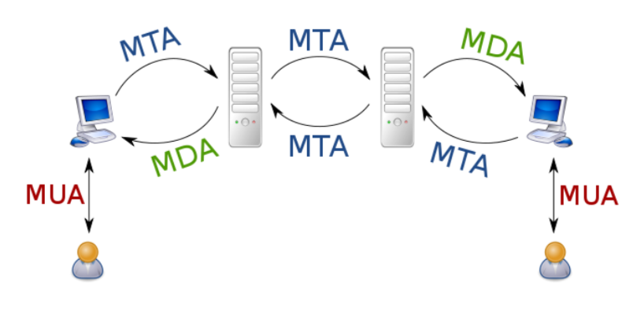
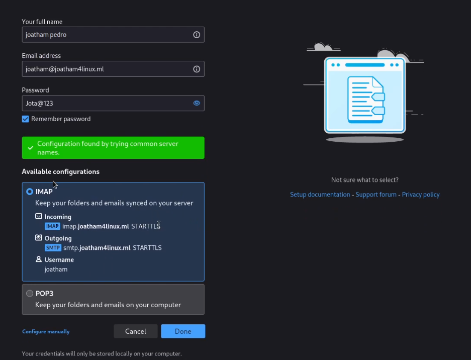
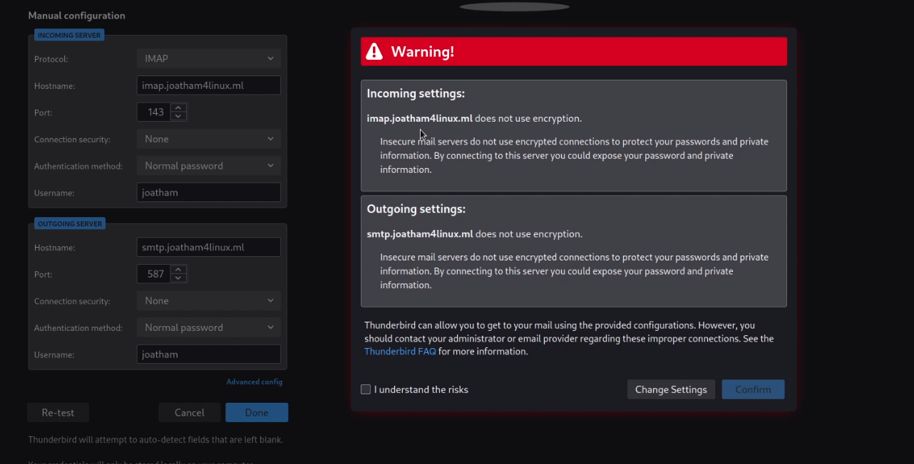
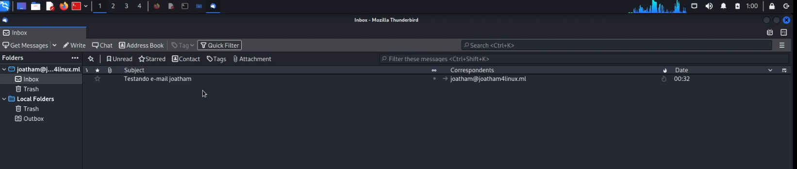
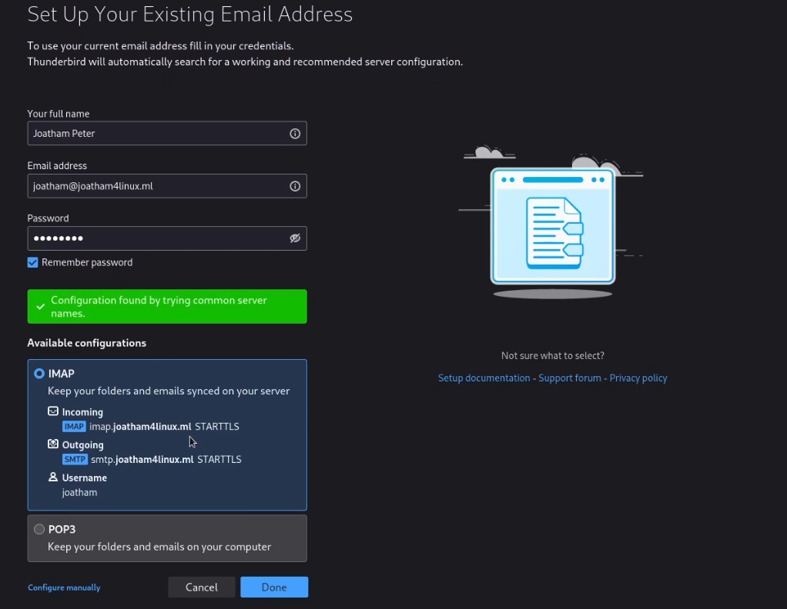
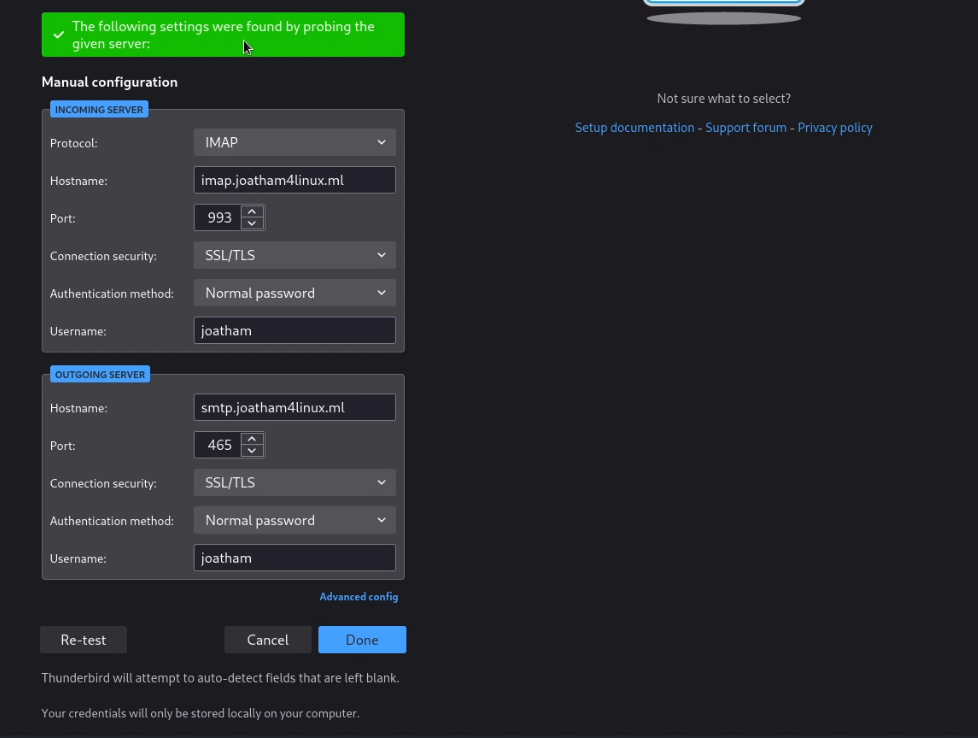
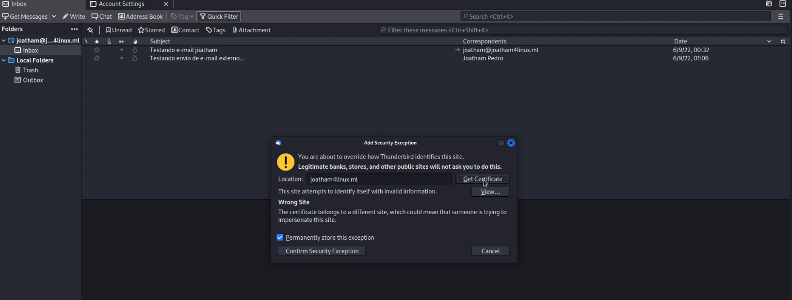
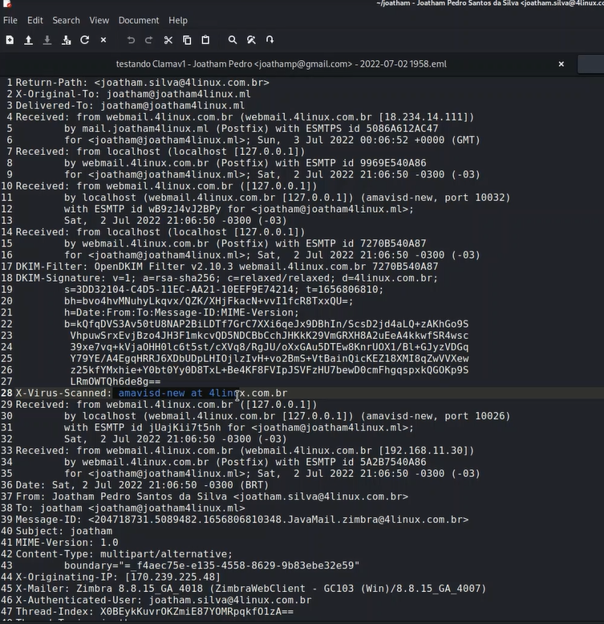

# Servidor de e-mail

Neste capítulo iremos entender o funcionamento de um servidor de e-mail, bem como configuraremos o Postfix como nosso servidor SMTP, e o Dovecot como o servidor IMAP/POP. Também iremos acessar o servidor por um cliente de e-mail.


## Introdução ao Postfix e suas características

Um servidor de mensagens eletrônicas é responsável pelo recebimento e envio de mensagens. Dentro deste processo há vários mecanismos utilizados pelo servidor antes da mensagem chegar até o remetente. Atualmente o maior responsável pelo tráfego na Internet é, sem dúvida, o e-mail. O SMTP (Simple Mail Transport Protocol) é o protocolo de transporte de mensagens utilizado em redes TCP/IP. Um servidor de mensagens oferece outros serviços além de transporte, este deve prover serviços como fornecer apelidos para usuários e fazer roteamento de mensagens. Como principais servidores de mensagens para Linux temos o Sendmail, o Qmail e o Postfix. Os dois últimos são servidores SMTP que surgiram como possíveis substitutos ao Sendmail, pelo fato do sendmail apresentar algumas deficiências: dificuldade de administrar e maior risco de segurança, pois seus processos utilizam o superusuário como dono.

No processo de troca de mensagens existem basicamente três agentes de mensagens: MTA (Mail Transport Agent), MUA (Mail User Agent) e MDA (Mail Delivery Agent).

* **MTA**: Sua finalidade é transportar um e-mail de um MTA até outro MTA. Como exemplo de MTA temos: sendmail, postfi x, qmail, Lotus Notes, MS Exchange Server etc.;
* **MUA**: O Agente de e-mail do usuário é um programa utilizado pelo usuário e tem as finalidades básicas de compor, ler e enviar e-mail. Exemplo de MUA: MS Outlook, Lotus Notes Messenger, Netscape Messenger, elm, mailx (ou mail), mutt, pine, Eudora, Pegasus etc.;
* **MDA**: Este agente tem como finalidade entregar localmente no servidor a mensagem para seu dono, ou seja, quando o e-mail chega no MTA (Servidor de e-mail), este agente irá armazenar o e-mail na caixa postal do destinatário. O MDA ainda pode fazer mais: filtrar e-mails indesejáveis, responder e-mails automaticamente (por exemplo, estou de férias...), encaminhar um e-mail automaticamente para outro etc. Como exemplos de MDA, temos: procmail, maildrop, mailagent, dovecot.

Funcionamento de envio e recebimento de e-mail:



### Postfix

Em 1998, as primeiras versões do “Postfix” começaram a surgir, como uma alternativa ao Sendmail. Wietse Venema é seu criador e possui inúmeros trabalhos relacionados à segurança da informação. Wietse é pesquisador da IBM e Ph.D em física até hoje. Escrita em linguagem C, a primeira versão oficial do "Postfix", como Software Livre, foi lançada em dezembro de 1998.

### Características do Postfix

* **Sistema multitarefa** - O "Postfix" possui um conjunto de módulos que desempenham um papel específico para cada etapa do tráfego de e-mails, este comportamento permite melhor desempenho em equipamentos multiprocessados;
* **Separação de privilégios** - O "Postfix" pode ser executado em "chroot" que restringe o acesso a arquivos internos à uma "jaula", tornando sua execução muito mais segura;
* **Modular** - É possível criar módulos para trabalhar em conjunto com o "Postfix", tornando-o facilmente extensível;
* **Compatibilidade** - O "Postfix" foi desenvolvido para suportar os formatos de armazenamentos de mensagens existentes.

O Postfix utiliza o SMTP (*Simple Mail Transfer Protocol*) que é um protocolo baseado em linhas de comando executado sobre o protocolo TCP, cujo objetivo é transmitir mensagens de e-mail dentre dois computadores. A porta utilizada pelo protocolo SMTP é a 25.

NOTA: A porta do SMTP pode ser alterada para 587 (STARTTLS) ou 465 (SSL).


## Instalação e configuração do Postfix

1. Instale o Postfix para configurar o servidor SMTP:

```shell
[root@srv02-oracle ~]# dnf -y install postfix
```

2. Este exemplo mostra como configurar o SMTP-Auth para usar a função SASL de Dovecot:

```shell
[root@srv02-oracle ~]# vi /etc/postfix/main.cf

# line 95: uncomment and specify hostname
myhostname = mail.joatham4linux.ml
# line 102: uncomment and specify domain name
mydomain = joatham4linux.ml
# line 118: uncomment
myorigin = $mydomain
# line 135: change
inet_interfaces = all
# line 138: change it if use only IPv4
inet_protocols = ipv4
# line 183: add
mydestination = $myhostname, localhost.$mydomain, localhost, $mydomain
# line 283: uncomment and specify your local network
mynetworks = 10.0.0/24, 192.168.100.0/24, 127.0.0.0/8
# line 438: uncomment (use Maildir)
home_mailbox = Maildir/
# line 593: add
smtpd_banner = $myhostname ESMTP
# add follows to the end
# for example, limit an email size for 10M
message_size_limit = 10485760
# for example, limit a mailbox for 1G
mailbox_size_limit = 1073741824

# SMTP-Auth setting
smtpd_sasl_type = dovecot
smtpd_sasl_path = private/auth
smtpd_sasl_auth_enable = yes
smtpd_sasl_security_options = noanonymous
smtpd_sasl_local_domain = $myhostname
smtpd_recipient_restrictions = permit_mynetworks, permit_auth_destination, permit_sasl_authenticated, reject
```

```shell
[root@srv02-oracle ~]# systemctl enable --now postfix
```

## Instalação e configuração do Dovecot

Para coletar suas mensagens, o usuário pode utilizar o protocolo POP (Post Office Protocol). Através do POP o usuário baixa as mensagens para seu computador local e as exclui do servidor. O POP não é utilizado para armazenamento permanente de mensagens. A porta `110` é padrão por este protocolo. Quando implementada uma camada de segurança ao POP, deverá trabalhar na porta `995`.

O IMAP (*Internet Message Access Protocol*) foi projetado para permitir que o usuário armazene as mensagens permanentemente no servidor. Com o IMAP o usuário pode acessar todas as mensagens a partir de qualquer lugar no mundo. O IMAP também tem uma implementação mais disseminada das conexões TLS seguras. A porta `143` é utilizada por este protocolo. IMAP sobre TLS é a porta `993`. 

Instale o Dovecot para configurar o servidor POP/IMAP:

```shell
[root@srv02-oracle ~]# dnf -y install dovecot
```

Este exemplo mostra como configurar para fornecer a função SASL ao Postfix.

```shell
[root@srv02-oracle ~]# vi /etc/dovecot/dovecot.conf
 # line 30: uncomment (if not use IPv6, remove [::])
listen = *
```

```shell
[root@srv02-oracle ~]# vi /etc/dovecot/conf.d/10-auth.conf
# line 10: uncomment and change (allow plain text auth)
disable_plaintext_auth = no
# line 100: add
auth_mechanisms = plain login
```

```shell
[root@srv02-oracle ~]# vi /etc/dovecot/conf.d/10-mail.conf
# line 30: uncomment and add
mail_location = maildir:~/Maildir
```

```shell
[root@srv02-oracle ~]# vi /etc/dovecot/conf.d/10-master.conf
# line 107: uncomment and add like follows
unix_listener /var/spool/postfix/private/auth {
    mode = 0666
    user = postfix
    group = postfix
}
```

```shell
[root@srv02-oracle ~]# vi /etc/dovecot/conf.d/10-ssl.conf
# line 8: change (not require SSL)
ssl = yes
```

```shell
[root@srv02-oracle ~]# systemctl enable --now dovecot
```

## Manipulando e-mails via CLI

Adicione contas de usuário de correio para usar o serviço de correio. Este exemplo é para o caso de você usar contas de usuário do sistema operacional. Defina as configurações básicas do Postfix e as configurações básicas do Dovecot primeiro.

Para usar contas de usuário do sistema operacional, basta adicionar o usuário do sistema operacional como segue:

```shell
[root@srv02-oracle ~]#  dnf -y install mailx
```

```shell
[root@srv02-oracle ~]# echo 'export MAIL=$HOME/Maildir' >> /etc/profile.d/mail.sh
[root@srv02-oracle ~]# export MAIL=$HOME/Maildir
[root@srv02-oracle ~]# echo $MAIL
```

```shell
[root@srv02-oracle ~]# useradd joatham
[root@srv02-oracle ~]# passwd joatham
[root@srv02-oracle ~]# useradd alana
[root@srv02-oracle ~]# passwd alana
[root@srv02-oracle ~]# useradd josue
[root@srv02-oracle ~]# passwd josue
```

Faça login como um usuário adicionado e tente enviar um e-mail:

```shell
[joatham@srv02-oracle ~]$ mail joatham@localhost

Subject: Testando e-mail joatham
E ai... Qualteupapo... Segue la..
.
EOT
```

```shell
[joatham@srv02-oracle ~]$ mail
Heirloom Mail version 12.5 7/5/10.  Type ? for help.
"/home/joatham/Maildir": 7 messages 2 new
>    1 joatham@joatham4linu  Thu Jun  9 04:32  19/647   "Testando e-mail joatham"

& 1
Message  1:
From joatham@joatham4linux.ml Thu Jun  9 04:32:10 2022
Return-Path: <joatham@joatham4linux.ml>
X-Original-To: joatham@joatham4linux.ml
Delivered-To: joatham@joatham4linux.ml
Date: Thu, 09 Jun 2022 04:32:10 +0000
To: joatham@joatham4linux.ml
Subject: Testando e-mail joatham
User-Agent: Heirloom mailx 12.5 7/5/10
Content-Type: text/plain; charset=us-ascii
From: joatham@joatham4linux.ml
Status: RO

E ai.. Qualteupapo... Segue la...
Segue o insta da 4linux
segue o insta do jota
```

```shell
[alana@srv02-oracle ~]$ mail
Heirloom Mail version 12.5 7/5/10.  Type ? for help.
"/home/alana/Maildir": 2 messages
>   1 joatham@joatham4linu  Thu Jun  9 04:36  18/683   "Testando e-mail para mamae"
& 1
Message  1:
From joatham@joatham4linux.ml Thu Jun  9 04:36:18 2022
Return-Path: <joatham@joatham4linux.ml>
X-Original-To: alana@joatham4linux.ml
Delivered-To: alana@joatham4linux.ml
Date: Thu, 09 Jun 2022 04:36:18 +0000
To: alana@joatham4linux.ml
Subject: Testando e-mail para mamae
User-Agent: Heirloom mailx 12.5 7/5/10
Content-Type: text/plain; charset=us-ascii
From: joatham@joatham4linux.ml
Status: RO

E ai mae.. tem o que para almocar ai hoje...tem aquela carne de panela.. com aquele feijao com charque
bjo e um queijo
```

### Enviando e-mail de forma externa via Telnet

```shell
[root@srv02-oracle ~]# vi /etc/postfix/master.cf

# ==========================================================================
# service type  private unpriv  chroot  wakeup  maxproc command + args
#               (yes)   (yes)   (no)    (never) (100)
# ==========================================================================
smtp      inet  n       -       n       -       -       smtpd
587       inet  n       -       n       -       -       smtpd
```

```shell
[root@srv02-oracle ~]# systemctl restart postfix
```

```shell
└─# telnet mail.joatham4linux.ml 587 
```
```shell
[josue@srv02-oracle ~]$ mail
Heirloom Mail version 12.5 7/5/10.  Type ? for help.
"/home/josue/Maildir": 1 message
>   1 joatham@joatham4linu  Thu Jun  9 04:46  10/402   "To te devendo seu note"
& 1
Message  1:
From joatham@joatham4linux.ml Thu Jun  9 04:46:28 2022
Return-Path: <joatham@joatham4linux.ml>
X-Original-To: josue@joatham4linux.ml
Delivered-To: josue@joatham4linux.ml
Subject: To te devendo seu note 
Status: RO

Cara.. vem aqui pra casa pegar teu note que o meu ja chegou..

& 
```

## Enviando e recebendo e-mails pela internet

Configure o seu cliente de e-mail na sua máquina. Este exemplo mostra com o Mozilla Thunderbird.

Execute o Thunderbird e clique em [Configurar uma conta] - [E-mail].

> Troque os termos do exemplo das figuras para atender as suas configurações






## Configurando certificados SSL para seus e-mails

Configure SSL/TLS para criptografar conexões.

### Obter certificado SSL

Obtenha certificados SSL de Let's Encrypt, que fornece certificados SSL grátis.

Consulte os detalhes do site oficial do Let's Encrypt abaixo.
https://letsencrypt.org/

A propósito, a data de validade de um certificado é 90 dias, então você deve atualizar nos próximos 90 dias.

É necessário que um servidor web, como Apache, httpd ou Nginx, esteja sendo executado no servidor em que você trabalha. Além disso, é necessário que seja possível acessar a Internet do seu servidor de trabalho na porta 80 por causa da verificação do Let's Encrypt.


1. Ajustar DNS para que o certificado gerado não dê erro:

```shell
[root@srv02-oracle ~]# vi /var/named/chroot/var/named/db.joatham4linux.ml.externa 


$TTL 86400
@           IN SOA ns1.joatham4linux.ml. admin.joatham4linux.ml. (
            2022070201; serial
            8h        ; refresh
            1w        ; expire
            1h        ; retry
            3d )      ; negative cache ttl

            IN      NS       ns1.joatham4linux.ml.
            IN      NS       ns2.joatham4linux.ml.
            IN      MX 10    smtp.joatham4linux.ml.
            IN      MX 20    ns2.joatham4linux.ml.
ns1         IN      A        152.70.212.171
ns2         IN      A        152.70.216.215
@           IN      A        152.70.212.171  <<----
vpn         IN      A        152.70.212.171
www         IN      A        152.70.212.171
blog        IN      A        152.70.212.171
pentwist    IN      A        152.70.216.215
foxclore    IN      A        152.70.216.215
smtp        IN      A        152.70.212.171
ftp         IN      A        152.70.212.171
ldap        IN      A        152.70.216.215
mail        IN      CNAME    ns1
pop         IN      CNAME    ns1
imap        IN      CNAME    ns1
webmail     IN      CNAME    ns1
@           IN      TXT      "v=spf1 a mx ip4:152.70.212.171 -all"

```

```shell
[root@srv02-oracle ~]# named-checkconf 
[root@srv02-oracle ~]# named-checkzone joatham4linux.ml /var/named/chroot/var/named/db.joatham4linux.ml.externa 
[root@srv02-oracle ~]# rndc reload
```
2. Criando certificado:

```shell
[root@srv02-oracle ~]# certbot-auto certonly --webroot -w /usr/share/nginx/html -d joatham4linux.ml
Bootstrapping dependencies for RedHat-based OSes that will use Python3... (you can skip this with --no-bootstrap)
dnf is /usr/bin/dnf
dnf is hashed (/usr/bin/dnf)
.....
.....
 # for only initial using, register your email address and agree to terms of use
 # specify valid email address
Enter email address (used for urgent renewal and security notices) 
(Enter 'c' to cancel): root@joatham4linux.ml 

- - - - - - - - - - - - - - - - - - - - - - - - - - - - - - - - - - - - - - - -
Please read the Terms of Service at
https://letsencrypt.org/documents/LE-SA-v1.2-November-15-2017.pdf. You must
agree in order to register with the ACME server at
https://acme-v02.api.letsencrypt.org/directory
- - - - - - - - - - - - - - - - - - - - - - - - - - - - - - - - - - - - - - - -
 # agree to the terms of use
(A)gree/(C)ancel: A

- - - - - - - - - - - - - - - - - - - - - - - - - - - - - - - - - - - - - - - -
Would you be willing to share your email address with the Electronic Frontier
Foundation, a founding partner of the Let's Encrypt project and the non-profit
organization that develops Certbot? We'd like to send you email about our work
encrypting the web, EFF news, campaigns, and ways to support digital freedom.
- - - - - - - - - - - - - - - - - - - - - - - - - - - - - - - - - - - - - - - -
(Y)es/(N)o: Y
Obtaining a new certificate
Performing the following challenges:
http-01 challenge for joatham4linux.ml
Using the webroot path /usr/share/nginx/html for all unmatched domains.
Waiting for verification...
Cleaning up challenges

IMPORTANT NOTES:
 - Congratulations! Your certificate and chain have been saved at:
   /etc/letsencrypt/live/joatham4linux.ml/fullchain.pem
   Your key file has been saved at:
   /etc/letsencrypt/live/joatham4linux.ml/privkey.pem
   Your cert will expire on 2020-03-17. To obtain a new or tweaked
   version of this certificate in the future, simply run certbot-auto
   again. To non-interactively renew *all* of your certificates, run
   "certbot-auto renew"
 - Your account credentials have been saved in your Certbot
   configuration directory at /etc/letsencrypt. You should make a
   secure backup of this folder now. This configuration directory will
   also contain certificates and private keys obtained by Certbot so
   making regular backups of this folder is ideal.
 - If you like Certbot, please consider supporting our work by:

   Donating to ISRG / Let's Encrypt:   https://letsencrypt.org/donate
   Donating to EFF:                    https://eff.org/donate-le

 # success if [Congratulations] is shown
 # certs are created under the [/etc/letsencrypt/live/(FQDN)/] directory 

 # cert.pem       ⇒ SSL Server cert(includes public-key)
 # chain.pem      ⇒ intermediate certificate
 # fullchain.pem  ⇒ combined file cert.pem and chain.pem
 # privkey.pem    ⇒ private-key file
```

3. Configure o `Postfix` e o `Dovecot`:

```shell
[root@srv02-oracle ~]# vim /etc/postfix/main.cf
# line 709, 715: comment out
#smtpd_tls_cert_file = /etc/pki/tls/certs/postfix.pem
#smtpd_tls_key_file = /etc/pki/tls/private/postfix.key
# add to the end (replace certificate to your own one)
smtpd_use_tls = yes
smtp_tls_mandatory_protocols = !SSLv2, !SSLv3
smtpd_tls_mandatory_protocols = !SSLv2, !SSLv3
smtpd_tls_cert_file = /etc/letsencrypt/live/joatham4linux.ml/fullchain.pem
smtpd_tls_key_file = /etc/letsencrypt/live/joatham4linux.ml/privkey.pem
smtpd_tls_session_cache_database = btree:${data_directory}/smtpd_scache
```

4. Descomente e deixe o arquivo `master.cf` como aparece abaixo:

```shell
[root@srv02-oracle ~]# vim /etc/postfix/master.cf
#                                                                                                                                                                                         
# Postfix master process configuration file.  For details on the format
# of the file, see the master(5) manual page (command: "man 5 master" or
# on-line: http://www.postfix.org/master.5.html).
#
# Do not forget to execute "postfix reload" after editing this file.
#
# ==========================================================================
# service type  private unpriv  chroot  wakeup  maxproc command + args
#               (yes)   (yes)   (no)    (never) (100)
# ==========================================================================
smtp      inet  n       -       n       -       -       smtpd
587       inet  n       -       n       -       -       smtpd
#smtp      inet  n       -       n       -       1       postscreen
#smtpd     pass  -       -       n       -       -       smtpd
#dnsblog   unix  -       -       n       -       0       dnsblog
#tlsproxy  unix  -       -       n       -       0       tlsproxy
submission inet n       -       n       -       -       smtpd
 -o syslog_name=postfix/submission
#  -o smtpd_tls_security_level=encrypt
 -o smtpd_sasl_auth_enable=yes
#  -o smtpd_tls_auth_only=yes
#  -o smtpd_reject_unlisted_recipient=no
#  -o smtpd_client_restrictions=$mua_client_restrictions
#  -o smtpd_helo_restrictions=$mua_helo_restrictions
#  -o smtpd_sender_restrictions=$mua_sender_restrictions
#  -o smtpd_recipient_restrictions=
#  -o smtpd_relay_restrictions=permit_sasl_authenticated,reject
#  -o milter_macro_daemon_name=ORIGINATING
smtps     inet  n       -       n       -       -       smtpd
 -o syslog_name=postfix/smtps
 -o smtpd_tls_wrappermode=yes
 -o smtpd_sasl_auth_enable=yes
#  -o smtpd_reject_unlisted_recipient=no
```

5. Ajuste o dovecot:

```shell
[root@srv02-oracle ~]# vim /etc/dovecot/conf.d/10-ssl.conf
# line 8: change (if set SSL required, specify [required])
ssl = yes
# line 14,15: specify certificates
ssl_cert = </etc/letsencrypt/live/joatham4linux.ml/fullchain.pem
ssl_key = </etc/letsencrypt/live/joatham4linux.ml/privkey.pem
```

```shell
[root@srv02-oracle ~]# systemctl restart postfix dovecot
```

6. Ajuste seu Firewall para trabalhar com as portas seguras:

```shell
[root@srv02-oracle ~]# iptables -nL
Chain INPUT (policy ACCEPT)
target     prot opt source               destination         
ACCEPT     tcp  --  0.0.0.0/0            0.0.0.0/0            tcp dpt:443
ACCEPT     tcp  --  0.0.0.0/0            0.0.0.0/0            tcp dpt:110
ACCEPT     tcp  --  0.0.0.0/0            0.0.0.0/0            tcp dpt:465
ACCEPT     tcp  --  0.0.0.0/0            0.0.0.0/0            tcp dpt:993
ACCEPT     tcp  --  0.0.0.0/0            0.0.0.0/0            tcp dpt:995
ACCEPT     tcp  --  0.0.0.0/0            0.0.0.0/0            tcp dpt:143
ACCEPT     tcp  --  0.0.0.0/0            0.0.0.0/0            tcp dpt:25
ACCEPT     tcp  --  0.0.0.0/0            0.0.0.0/0            tcp dpt:587
ACCEPT     tcp  --  0.0.0.0/0            0.0.0.0/0            tcp dpt:80
ACCEPT     udp  --  0.0.0.0/0            0.0.0.0/0            udp dpt:1194
ACCEPT     tcp  --  0.0.0.0/0            0.0.0.0/0            tcp dpt:53
ACCEPT     udp  --  0.0.0.0/0            0.0.0.0/0            udp dpt:53
ACCEPT     tcp  --  0.0.0.0/0            0.0.0.0/0            tcp dpt:19999
ACCEPT     tcp  --  0.0.0.0/0            0.0.0.0/0            tcp dpt:9000
ACCEPT     all  --  0.0.0.0/0            0.0.0.0/0            state RELATED,ESTABLISHED
ACCEPT     icmp --  0.0.0.0/0            0.0.0.0/0           
ACCEPT     all  --  0.0.0.0/0            0.0.0.0/0           
ACCEPT     tcp  --  0.0.0.0/0            0.0.0.0/0            state NEW tcp dpt:22
DROP       all  --  0.0.0.0/0            0.0.0.0/0           

Chain FORWARD (policy ACCEPT)
target     prot opt source               destination         

Chain OUTPUT (policy ACCEPT)
target     prot opt source               destination         
```

7. Crie novamente a conta, agora apontando para as portas e servicos seguros.






## Implementando Antivírus no e-mail

1. Instale o clamav:

```shell
[root@srv02-oracle ~]# dnf --enablerepo=epel -y install clamav clamav-update
```

```shell
[root@srv02-oracle ~]# freshclam
ClamAV update process started at Thu jun 26 00:45:12 2022
main.cvd is up to date (version: 58, sigs: 4566249, f-level: 60, builder: sigmgr)
daily.cvd is up to date (version: 25583, sigs: 1778105, f-level: 63, builder: raynman)
bytecode.cvd is up to date (version: 331, sigs: 94, f-level: 63, builder: anvilleg)

Tente fazer a varredura do sistema.


Data read: 0.00 MB (ratio 0.00:1)
Time: 40.722 sec (0 m 40 s)
```

2. Instale o amavisd e suas dependências:

Acesse o site: https://yum.oracle.com/repo/OracleLinux/OL8/codeready/builder/x86_64/index.html

```shell
[root@srv02-oracle ~]# wget https://yum.oracle.com/repo/OracleLinux/OL8/codeready/builder/x86_64/getPackage/perl-IO-stringy-2.111-9.el8.noarch.rpm
[root@srv02-oracle ~]# rpm -qi perl-IO-stringy-2.111-9.el8.noarch.rpm
[root@srv02-oracle ~]# dnf -y install amavisd-new clamd perl-Digest-SHA
```

3. Ajustes finos do Antivírus:

```shell
[root@srv02-oracle ~]# /etc/clam.d
[root@srv02-oracle ~]# vim scan.conf

# Descomente as seguintes linhas
14 LogFile /var/log/clamd.scan
77 PidFile /run/clamd.scan/clamd.pid
81 TemporaryDirectory /var/tmp
96 LocalSocket /run/clamd.scan/clamd.sock
```

```shell
[root@srv02-oracle ~]# touch /var/log/clamd.scan
[root@srv02-oracle ~]# chown clamscan. /var/log/clamd.scan
```

```shell
[root@srv02-oracle ~]# systemctl enable --now clamd@scan
[root@srv02-oracle ~]# systemctl status clamd@scan
```

```shell
[root@srv02-oracle ~]# vim /etc/amavisd/amavisd.conf

# Ajuste o arquivo nas seguintes linhas
23 $mydomain = 'joatham4linux.ml';   # a convenient default for other settings
158 $myhostname = 'mail.joatham4linux.ml';  # must be a fully-qualified domain name!
163 $notify_method  = 'smtp:[127.0.0.1]:10023';
164 $forward_method = 'smtp:[127.0.0.1]:10023';  # set to undef with milter!
```

```shell
[root@srv02-oracle ~]# systemctl enable --now amavisd
[root@srv02-oracle ~]# systemctl status amavisd
```

4. Ajustes finos do Postfix:

```shell
[root@srv02-oracle ~]# /etc/postfix/master.cf

# Insira no final do arquivo
smtp-amavis unix -  -   n - 2 smtp
  -o syslog_name=postfix/amavis
  -o smtp_data_done_timeout=1200
  -o smtp_send_xforward_command=yes
  -o disable_dns_lookups=yes
  -o max_use=20
  -o smtp_tls_security_level=none

127.0.0.1:10025 inet n  - n - - smtpd
  -o syslog_name=postfix/10025
  -o content_filter=
  -o mynetworks_style=host
  -o mynetworks=127.0.0.0/8
  -o local_recipient_maps=
  -o relay_recipient_maps=
  -o strict_rfc821_envelopes=yes
  -o smtp_tls_security_level=none
  -o smtpd_tls_security_level=none
  -o smtpd_restriction_classes=
  -o smtpd_delay_reject=no
  -o smtpd_client_restrictions=permit_mynetworks,reject
  -o smtpd_helo_restrictions=
  -o smtpd_sender_restrictions=
  -o smtpd_recipient_restrictions=permit_mynetworks,reject
  -o smtpd_end_of_data_restrictions=
  -o smtpd_error_sleep_time=0
  -o smtpd_soft_error_limit=1001
  -o smtpd_hard_error_limit=1000
  -o smtpd_client_connection_count_limit=0
  -o smtpd_client_connection_rate_limit=0
  -o receive_override_options=no_header_body_checks,no_unknown_recipient_checks,no_address_mappings
```

```shell
[root@srv02-oracle ~]# systemctl restart postfix
[root@srv02-oracle ~]# systemctl status postfix
```

5. Teste se o amavisd checa seus e-mails:




6. Teste ainda o clamav no terminal:
```shell
# download trial virus
[root@srv02-oracle ~]# wget http://www.eicar.org/download/eicar.com
[root@srv02-oracle ~]# clamscan --infected --remove --recursive .

 # just detected and removed
./eicar.com: Eicar-Test-Signature FOUND
./eicar.com: Removed.

----------- SCAN SUMMARY -----------
Known viruses: 6334004
Engine version: 0.101.4
Scanned directories: 1
Scanned files: 9
Infected files: 1
Data scanned: 0.01 MB
Data read: 0.00 MB (ratio 2.00:1)
Time: 39.496 sec (0 m 39 s)
```

### Criando aliases no Postfix

Crie um apelido para seus usuários no arquivo `aliases`:

```shell
[root@srv02-oracle ~]# # vim /etc/aliases
joatham: jota
```

Para validar essas modificações e gerar o arquivo de **hash**, precisamos usar o comando `postalias` ou `newaliases`:

```shell
[root@srv02-oracle ~]# postalias /etc/aliases
```

ou

```shell
[root@srv02-oracle ~]# newaliases
```

Neste capítulo instalamos e configuramos nossos servidores de e-mail, bem como fizemos testes de envio e recebimento de mensagens eletrônicas.
